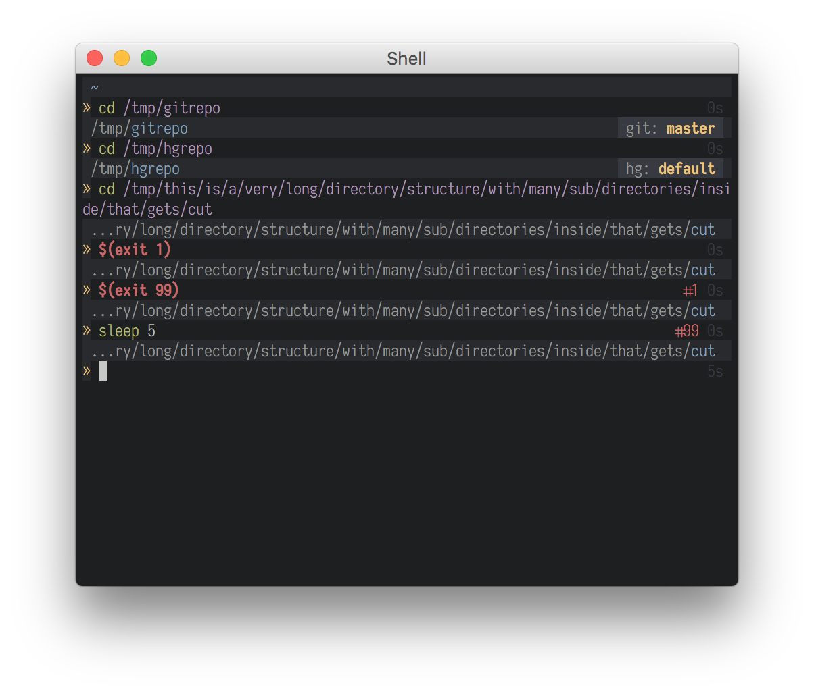

Pad
===

Pad is a simple, concise and beautiful theme for [oh-my-zsh][oh-my-zsh].



Requirements
------------

Pad currently requires:
* [oh-my-zsh][oh-my-zsh]
* The [Base 16][base-16] color scheme
* The [Base 16 Shell][base-16-shell] fix

Installation
------------

Clone this repository:

```sh
git clone https://github.com/eproxus/pad.zsh-theme.git
```

Run the install script, which will link this theme into your oh-my-zsh
installation:

```sh
./install.sh
```

In your `~/.zshrc`, set your theme to Pad:

```sh
ZSH_THEME="pad"
```


[oh-my-zsh]: https://github.com/robbyrussell/oh-my-zsh "Oh My Zsh"
[base-16]: https://github.com/chriskempson/base16 "Base 16 Color Scheme"
[base-16-shell]: https://github.com/chriskempson/base16-shell "Base 16 Shell"